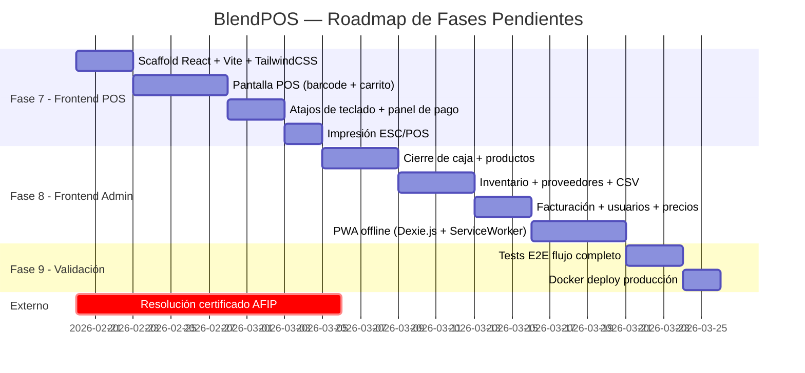

# Análisis Integral del Proyecto BlendPOS (Go)

> **Fecha:** 19 de febrero de 2026  
> **Autor:** Analista Senior de Proyectos  
> **Versión del análisis:** 1.0

---

## 1. Resumen Ejecutivo

**BlendPOS** es un sistema de punto de venta (POS) de misión crítica diseñado para kioscos y drugstores argentinos. El proyecto está en proceso de **migración de Python a Go**, con un backend avanzado y documentación de alta calidad. **Las fases 1 a 6 del backend están implementadas. No existe frontend. El AFIP Sidecar está completo a nivel código pero bloqueado por un tema administrativo con AFIP.**

| Aspecto | Estado |
|---------|--------|
| Documentación | ✅ Excelente (7 documentos formales) |
| Backend Go (Fases 1-6) | ✅ Implementado |
| AFIP Sidecar (Python) | ⚠️ Código completo, certificado AFIP pendiente |
| Frontend React (Fases 7-8) | ❌ No existe |
| Tests E2E / Deploy (Fase 9) | ❌ No existe |

---

## 2. Estado de las Fases

### ✅ Fase 1: Infraestructura, Auth y Configuración — **COMPLETADA**

| Tarea | Estado | Evidencia |
|-------|--------|-----------|
| T-1.1: Scaffold Go + Gin | ✅ | [main.go](file:///c:/Users/juani/Desktop/BlendPos/backend/cmd/server/main.go) con graceful shutdown, zerolog, worker pool init |
| T-1.2: Modelos GORM + Migraciones | ✅ | 8 modelos en `internal/model/`, 2 migraciones SQL en `migrations/` |
| T-1.3: JWT Auth + Roles | ✅ | [auth_service.go](file:///c:/Users/juani/Desktop/BlendPos/backend/internal/service/auth_service.go), middleware JWT + RequireRole, bcrypt |

**Detalle:**
- Estructura de carpetas sigue el Standard Go Project Layout (`cmd/`, `internal/`)
- Configuración via Viper (`internal/config/`)
- 5 middleware implementados: `auth.go`, `cors.go`, `error_handler.go`, `rate_limiter.go`, `request_id.go`
- Docker multi-stage build: [Dockerfile](file:///c:/Users/juani/Desktop/BlendPos/backend/Dockerfile) + [Dockerfile.dev](file:///c:/Users/juani/Desktop/BlendPos/backend/Dockerfile.dev)
- Hot reload con Air: [.air.toml](file:///c:/Users/juani/Desktop/BlendPos/backend/.air.toml)
- `GET /health` funcional con verificación de DB y Redis
- Seed de admin en [seed_admin_pass.sql](file:///c:/Users/juani/Desktop/BlendPos/backend/migrations/seed_admin_pass.sql)

---

### ✅ Fase 2: Productos e Inventario — **COMPLETADA**

| Tarea | Estado | Evidencia |
|-------|--------|-----------|
| T-2.1: CRUD Productos | ✅ | [productos.go](file:///c:/Users/juani/Desktop/BlendPos/backend/internal/handler/productos.go) con CRUD completo, búsqueda por barcode y nombre |
| T-2.2: Relación Padre/Hijo + Desarme | ✅ | [inventario_service.go](file:///c:/Users/juani/Desktop/BlendPos/backend/internal/service/inventario_service.go) (7.5KB) con lógica de desarme atómico |

**Detalle:**
- Endpoints: `POST/GET/PUT/DELETE /v1/productos`, `POST /v1/inventario/vinculos`, `POST /v1/inventario/desarme`, `GET /v1/inventario/alertas`
- Repository pattern con interfaz + implementación GORM: [producto_repo.go](file:///c:/Users/juani/Desktop/BlendPos/backend/internal/repository/producto_repo.go) (5.5KB)
- DTOs con tags de validación: [producto_dto.go](file:///c:/Users/juani/Desktop/BlendPos/backend/internal/dto/producto_dto.go) (3.7KB)
- Tests: [inventario_test.go](file:///c:/Users/juani/Desktop/BlendPos/backend/tests/inventario_test.go) (11.5KB)

---

### ✅ Fase 3: Ventas — **COMPLETADA**

| Tarea | Estado | Evidencia |
|-------|--------|-----------|
| T-3.1: Servicio de Ventas ACID | ✅ | [venta_service.go](file:///c:/Users/juani/Desktop/BlendPos/backend/internal/service/venta_service.go) (323 líneas, 10KB) |
| T-3.2: Multi-método de Pago | ✅ | Integrado en `RegistrarVenta()` |

**Detalle:**
- Transacción ACID completa: items + stock + caja en un solo `db.Transaction`
- `RegistrarVenta()` abarca 158 líneas con: validación de caja abierta, resolución de productos, cálculo de totales, registro de pagos múltiples
- `AnularVenta()` implementado con restauración de stock y movimiento inverso
- `SyncBatch()` para sincronización offline con deduplicación por `offline_id`
- Dispatch de job de facturación asíncrono post-commit
- Tests: [ventas_test.go](file:///c:/Users/juani/Desktop/BlendPos/backend/tests/ventas_test.go) (13KB)

---

### ✅ Fase 4: Gestión de Caja — **COMPLETADA**

| Tarea | Estado | Evidencia |
|-------|--------|-----------|
| T-4.1: Ciclo de vida completo | ✅ | [caja_service.go](file:///c:/Users/juani/Desktop/BlendPos/backend/internal/service/caja_service.go) (249 líneas, 8.8KB) |

**Detalle:**
- **Abrir**: validación de caja duplicada por punto de venta (AC-04.1, AC-04.2)
- **Movimientos inmutables**: no hay Update/Delete, anulaciones generan inverso (AC-04.3)
- **Arqueo ciego**: declaración del cajero → cálculo de desvío post-declaración (AC-04.4)
- **Clasificación**: normal ≤1%, advertencia ≤5%, crítico >5% (AC-04.5)
- **Reporte completo**: desglose por método de pago (AC-04.6)
- Tests: [caja_test.go](file:///c:/Users/juani/Desktop/BlendPos/backend/tests/caja_test.go) (11KB)

---

### ✅ Fase 5: Facturación — **COMPLETADA** (con bloqueo externo)

| Tarea | Estado | Evidencia |
|-------|--------|-----------|
| T-5.1: PDF internos + Email | ✅ | [pdf.go](file:///c:/Users/juani/Desktop/BlendPos/backend/internal/infra/pdf.go) (5.5KB), [email_worker.go](file:///c:/Users/juani/Desktop/BlendPos/backend/internal/worker/email_worker.go) |
| T-5.2: Integración AFIP (Sidecar) | ⚠️ | Código 100%, bloqueado por certificado |

**Detalle del Backend Go:**
- Worker pool de goroutines: [pool.go](file:///c:/Users/juani/Desktop/BlendPos/backend/internal/worker/pool.go) (3.8KB)
- Facturación con retry y backoff exponencial (max 3): [facturacion_worker.go](file:///c:/Users/juani/Desktop/BlendPos/backend/internal/worker/facturacion_worker.go) (207 líneas)
- Flujo completo: AFIP Sidecar call → CAE → PDF → Email (todo asíncrono)
- Cliente HTTP AFIP: [afip.go](file:///c:/Users/juani/Desktop/BlendPos/backend/internal/infra/afip.go)
- Tests: [facturacion_test.go](file:///c:/Users/juani/Desktop/BlendPos/backend/tests/facturacion_test.go) (11KB)

**Detalle del AFIP Sidecar (Python):**
- [main.py](file:///c:/Users/juani/Desktop/BlendPos/afip-sidecar/main.py) (282 líneas): FastAPI con endpoints `/health` y `/facturar`
- [afip_client.py](file:///c:/Users/juani/Desktop/BlendPos/afip-sidecar/afip_client.py) (16.6KB): WSAA auth + WSFEV1 facturación
- [schemas.py](file:///c:/Users/juani/Desktop/BlendPos/afip-sidecar/schemas.py) (5.3KB): Pydantic models
- 8 archivos de patches para compatibilidad pyafipws con Python 3.11
- Dockerfile con usuario non-root, healthcheck, certificados montados

> [!WARNING]
> **Bloqueante**: AFIP rechaza el certificado con error `cms.cert.untrusted`. Es un tema administrativo/de registro, no de código. Ver [ESTADO_ACTUAL.md](file:///c:/Users/juani/Desktop/BlendPos/afip-sidecar/ESTADO_ACTUAL.md)

---

### ✅ Fase 6: Proveedores — **COMPLETADA**

| Tarea | Estado | Evidencia |
|-------|--------|-----------|
| T-6.1: CRUD + Actualización masiva | ✅ | [proveedor_service.go](file:///c:/Users/juani/Desktop/BlendPos/backend/internal/service/proveedor_service.go) (490 líneas, 15KB) |
| T-6.2: Import CSV | ✅ | Integrado en `proveedor_service.go` |

**Detalle:**
- CRUD completo con soft-delete
- Actualización masiva con modo preview (AC-07.3): calcula sin aplicar cambios
- Historial inmutable de cambios de precios con nueva migración: [000002_historial_precios.up.sql](file:///c:/Users/juani/Desktop/BlendPos/backend/migrations/000002_historial_precios.up.sql)
- Import CSV robusto: validación de encabezados, detección de binarios (ZIP/XLSX), parseo por fila con error reporting
- Upsert por código de barras
- Tests: [proveedor_test.go](file:///c:/Users/juani/Desktop/BlendPos/backend/tests/proveedor_test.go) (15.9KB)

---

### ❌ Fase 7: Frontend POS — **NO INICIADA**

| Tarea | Estado |
|-------|--------|
| T-7.1: Pantalla POS | ❌ No existe directorio `frontend/` |

Falta: React + Vite + TypeScript + TailwindCSS + ShadcnUI. Incluye búsqueda por barcode, carrito interactivo, atajos de teclado, panel de pago con vuelto, impresión ESC/POS.

---

### ❌ Fase 8: Frontend Administración — **NO INICIADA**

| Tarea | Estado |
|-------|--------|
| T-8.1: Páginas de gestión | ❌ No existe |

Falta: Cierre de caja, productos, inventario, proveedores, facturación, usuarios, consulta de precios. PWA offline (Dexie.js + ServiceWorker).

---

### ❌ Fase 9: Validación y Deploy — **NO INICIADA**

| Tarea | Estado |
|-------|--------|
| T-9.1: Tests E2E | ❌ |
| T-9.2: Docker deploy prod | ⚠️ Parcial — `docker-compose.prod.yml` existe pero sin frontend |

> [!NOTE]
> Los archivos [docker-compose.yml](file:///c:/Users/juani/Desktop/BlendPos/docker-compose.yml) y [docker-compose.prod.yml](file:///c:/Users/juani/Desktop/BlendPos/docker-compose.prod.yml) existen y definen la orquestación con Traefik + SSL, pero faltan los servicios de frontend.

---

## 3. Inventario Técnico del Backend

### Endpoints REST implementados (desde [router.go](file:///c:/Users/juani/Desktop/BlendPos/backend/internal/router/router.go))

| Grupo | Endpoints | Roles |
|-------|-----------|-------|
| Health | `GET /health` | Público |
| Auth | `POST /v1/auth/login`, `POST /v1/auth/refresh` | Público (rate limited) |
| Precio | `GET /v1/precio/:barcode` | Público (RF-27) |
| Ventas | `POST /v1/ventas`, `DELETE /v1/ventas/:id`, `POST /v1/ventas/sync-batch` | cajero+ / supervisor+ |
| Productos | CRUD `POST/GET/PUT/DELETE /v1/productos` | administrador |
| Inventario | `POST vinculos`, `GET vinculos`, `POST desarme`, `GET alertas` | admin + supervisor |
| Caja | `POST abrir/arqueo/movimiento`, `GET :id/reporte` | cajero+ |
| Facturación | `GET /:venta_id`, `GET /pdf/:id` | admin + supervisor |
| Proveedores | CRUD + `POST /:id/precios/masivo` | administrador |
| CSV | `POST /v1/csv/import` | administrador |
| Usuarios | CRUD | administrador |

**Total: ~25 endpoints funcionales.**

### Dependencias Go (go.mod)

| Librería | Versión | Uso |
|----------|---------|-----|
| gin-gonic/gin | v1.10.0 | Framework HTTP |
| gorm.io/gorm | v1.25.12 | ORM |
| jackc/pgx/v5 | v5.6.0 | Driver PostgreSQL nativo |
| redis/go-redis/v9 | v9.6.1 | Cache + Job Queue |
| golang-jwt/jwt/v5 | v5.2.1 | Autenticación JWT |
| shopspring/decimal | v1.4.0 | Aritmética monetaria precisa |
| go-pdf/fpdf | v0.9.0 | Generación PDF |
| rs/zerolog | v1.33.0 | Logging estructurado |
| spf13/viper | v1.19.0 | Configuración |
| stretchr/testify | v1.9.0 | Testing |

---

## 4. Análisis de Calidad

### 🟢 Fortalezas

1. **Documentación excepcional**: 7 documentos complementarios que cubren visión, arquitectura ADR, especificación formal (Given/When/Then), requisitos EARS, habilidades, guía de ejecución y referencia rápida. Esto es **raro y valioso** en proyectos reales.

2. **Arquitectura sólida y bien fundamentada**: Layered Architecture + Transactional Script es una combinación pragmática y excelente para un POS. Las ADRs justifican cada decisión (Go + Sidecar Python, Gin vs alternativas, goroutines vs Celery).

3. **Transaccionalidad ACID rigurosa**: Todas las operaciones de venta, stock y caja están envueltas en `db.Transaction()`. El desarme atómico dentro de la misma TX es correcto.

4. **Separación de capas estricta**: Handler → Service → Repository sin atajos. Los handlers no tienen lógica de negocio. Los services usan interfaces de repositories. Dependency injection por constructores.

5. **Worker pool nativo de Go**: Excelente decisión eliminar Celery. El worker pool con goroutines + Redis BRPOP es más simple, eficiente y operacionalmente liviano.

6. **AFIP Sidecar como patrón de aislamiento**: Decisión arquitectónica acertada. pyafipws es una librería probada en producción; reimplementarla en Go sería un esfuerzo sin retorno.

7. **Tests completos**: 6 archivos de test (~76KB total) que cubren auth, ventas, inventario, caja, facturación y proveedores.

8. **Seguridad**: bcrypt cost 12, JWT con roles, rate limiting, error handler que no expone stack traces, validación MIME en CSV upload.

### 🟡 Observaciones

1. **Sin handlerless tests unitarios puros**: Los tests parecen ser de integración (test through HTTP). Faltarían unit tests puros del service layer con mocks de repositorios.

2. **Configuración AFIP hardcodeada parcialmente**: En `facturacion_worker.go` línea 104, `TipoCBTE: 11` y `PuntoVenta: 1` están hardcodeados. Deberían venir de la configuración.

3. **Error handling con strings**: Algunos errores se comparan con `strings.Contains(err.Error(), "unique")` en vez de usar errores tipados de GORM. Esto es frágil.

4. **Sin Swagger/OpenAPI**: El `CLAUDE.md` menciona `swaggo/swag` como requerimiento pero no hay evidencia de implementación.

5. **La resolución de conflictos offline es deuda técnica declarada**: El documento de arquitectura lo reconoce explícitamente para Fase 8, pero es un riesgo operativo significativo para escenarios multi-terminal.

### 🔴 Riesgos

1. **Sin frontend = sin producto usable**: El 67% del backend está listo, pero el 0% del frontend. Un POS sin interfaz no tiene valor de negocio.

2. **Certificado AFIP bloqueante**: Es un trámite administrativo con AFIP que puede demorar de días a semanas. Sin resolverlo, la facturación fiscal no funciona en ningún ambiente.

3. **La documentación describe capacidades PWA/offline-first que aún no existen**: Dexie.js, SyncQueue, SyncEngine, ServiceWorker — todo esto es Fase 7-8 y no hay código.

---

## 5. Roadmap: Lo que resta

### Estimación de esfuerzo restante

| Fase | Esfuerzo estimado | Complejidad | Dependencias |
|------|-------------------|-------------|-------------|
| Fase 7 (Frontend POS) | 10-15 días | Alta — UX crítica para operación | API Backend lista ✅ |
| Fase 8 (Frontend Admin + PWA) | 12-16 días | Alta — offline-first es complejo | API Backend lista ✅ |
| Fase 9 (E2E + Deploy) | 5-7 días | Media | Frontend + Backend |
| AFIP Certificado | Variable (1-14 días) | Baja técnica, alta burocrática | Gestión administrativa |
| **Total restante** | **27-38 días** | | |

---

## 6. Opinión Profesional

### Lo destacable

Este proyecto tiene una **madurez documental y arquitectónica inusual para su estado de desarrollo**. La mayoría de proyectos en este nivel de avance no tienen ni la mitad de la documentación formal que BlendPOS posee. Los 7 documentos son coherentes entre sí, las decisiones arquitectónicas están justificadas con ADRs, y la especificación formal con Given/When/Then es un activo valioso que permite a cualquier desarrollador (humano o AI) entender exactamente qué se espera.

La elección de **Go como lenguaje principal fue correcta** para un POS de misión crítica: latencia predecible, concurrencia nativa sin Celery, binario estático para deploys simples, y el patrón Sidecar para AFIP es una decisión pragmática excelente que evita meses de trabajo en reimplementar SOAP/CMS en Go.

La calidad del código backend es **profesional**: interfaces, inyección de dependencias, capas bien separadas, transacciones ACID, error handling consistente, y workers asíncronos bien diseñados. El `venta_service.go` con su `RegistrarVenta()` de 158 líneas que orquesta validación, resolución de productos, transacción ACID con desarme, movimientos de caja y dispatch de facturación es **el corazón del sistema y está bien construido**.

### Lo preocupante

1. **El proyecto tiene un desequilibrio backend/frontend severo**: 6 fases de backend completadas, 0 de frontend. Un POS es un producto orientado al usuario final — sin interfaz, todo el trabajo de backend es potencial no realizado.

2. **La complejidad de Fase 8 está subestimada**: Implementar una PWA offline-first con IndexedDB, SyncQueue, SyncEngine y resolución de conflictos no es trivial. El documento marca la resolución de conflictos como "deuda técnica para Fase 8", pero es una pieza central de la propuesta de valor del producto.

3. **Riesgo de "documentación perfecta, producto incompleto"**: La documentación es tan buena que puede dar una falsa sensación de completitud. El sistema no es operativo sin frontend.

### Recomendaciones

1. **Priorizar Fase 7 inmediatamente**: Un MVP POS funcional (aunque sin PWA offline) generaría valor de negocio y permitiría validar el backend con usuarios reales.

2. **Resolver el certificado AFIP en paralelo**: Es un trámite independiente del desarrollo. Iniciar hoy puede ahorrar semanas de espera.

3. **Simplificar Fase 8**: Implementar primero sin offline (SPA normal conectada al backend) y agregar PWA/offline como una Fase 8b separada. Esto acorta el time-to-market.

4. **Agregar Swagger/OpenAPI**: Es un requisito declarado en `requirements.md` pero no implementado. Es valioso para documentar la API existente y facilitar el desarrollo frontend.

5. **Corregir valores hardcodeados en el facturacion_worker**: Tipo de comprobante y punto de venta deben venir de configuración.

---

## 7. Conclusión

BlendPOS es un proyecto con **documentación de nivel enterprise, arquitectura sólida y un backend bien ejecutado**. El principal desafío es la brecha de ejecución entre backend y frontend. El sistema tiene todas las bases para ser un producto comercializable — falta construir la cara visible del producto.

**Progreso general estimado: 55-60%** (ponderando backend, frontend, testing y deploy).

| Componente | Peso | Avance | Contribución |
|------------|------|--------|-------------|
| Documentación | 10% | 95% | 9.5% |
| Backend Go | 35% | 90% | 31.5% |
| AFIP Sidecar | 10% | 85% | 8.5% |
| Frontend | 30% | 0% | 0% |
| Tests E2E | 10% | 20% | 2% |
| Deploy Prod | 5% | 40% | 2% |
| **Total** | **100%** | | **~54%** |
